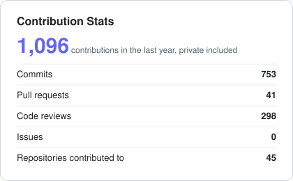
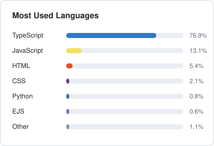

 

---

## About Me

Full Stack Developer with **more than 3 years of experience** designing, building and shipping web applications end to end. I currently work as **Team Leader at useTeam**, where I combine hands-on development with architecture decisions, code reviews and technical mentoring.

- Building modern products with **TypeScript** across the stack: **NestJS, Prisma and PostgreSQL** on the backend, **React, Next.js and Vite** on the frontend, shipped with **Docker and AWS**.
- Focused on code quality, performance and great user experience.
- Collaborative by nature: I enjoy leading teams and helping other developers grow.
- Based in Argentina. Languages: Spanish (native), English.

## Tech Stack

<h4>Languages</h4>

<picture>
  <source media="(prefers-color-scheme: dark)" srcset="https://skillicons.dev/icons?i=ts%2Cjs%2Cpython%2Chtml%2Ccss&perline=10&theme=dark">
  
</picture>

<h4>Backend</h4>

<picture>
  <source media="(prefers-color-scheme: dark)" srcset="https://skillicons.dev/icons?i=nestjs%2Cnodejs%2Cexpress%2Cprisma%2Cpostgres%2Cmongodb&perline=10&theme=dark">
  
</picture>

<h4>Frontend</h4>

<picture>
  <source media="(prefers-color-scheme: dark)" srcset="https://skillicons.dev/icons?i=react%2Cnextjs%2Cvite%2Ctailwind%2Credux%2Cremix%2Castro&perline=10&theme=dark">
  
</picture>

<h4>Integrations & APIs</h4>

<h4>Cloud & DevOps</h4>

<picture>
  <source media="(prefers-color-scheme: dark)" srcset="https://skillicons.dev/icons?i=aws%2Cdocker%2Cgithubactions%2Cgit%2Cgithub%2Cvercel%2Ccloudflare&perline=10&theme=dark">
  
</picture>

## GitHub Stats

## Let's Connect

Have a project in mind or want to collaborate? Reach out on [LinkedIn](https://www.linkedin.com/in/nabil-allis/) or visit my [portfolio](https://nabil-allis.vercel.app/).

